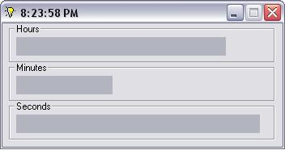



## \[Progressbar Based Clock\]

### Description

A clock that uses progressbars to show the time.

Teaches how to get hour, minute, and second. And how to make a simple animated icon, and make a tray icon.
 
### More Info
 

             |
---                |---
**Submitted On**   |2005-02-10 22:38:42
**By**             |[LCSBSSRHXXX](https://github.com/Planet-Source-Code/PSCIndex/blob/master/ByAuthor/lcsbssrhxxx.md)
**Level**          |Intermediate
**User Rating**    |4.4 (48 globes from 11 users)
**Compatibility**  |VB 6\.0
**Category**       |[Miscellaneous](https://github.com/Planet-Source-Code/PSCIndex/blob/master/ByCategory/miscellaneous__1-1.md)
**World**          |[Visual Basic](https://github.com/Planet-Source-Code/PSCIndex/blob/master/ByWorld/visual-basic.md)
**Archive File**   |[\[Progressb1853822162005\.zip](https://github.com/Planet-Source-Code/lcsbssrhxxx-progressbar-based-clock__1-58961/archive/master.zip)

